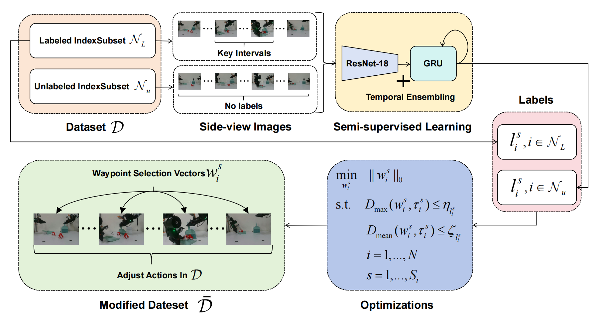
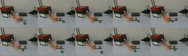
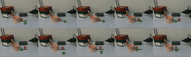
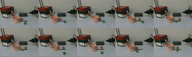
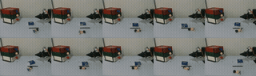
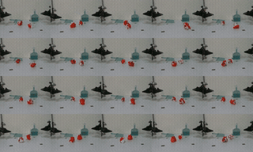
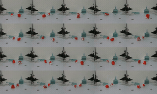

# HiWE: Hierarchical Waypoint Extraction

Data preprocessing toolkit for imitation learning. It is for improving policy success rate by refining raw demos—human data often has noise and redundant motions that cause compounding errors at deployment. This tool identifies critical segments (grasp, insert, etc.), extracts sparse waypoints with stricter constraints where precision matters, and relabels actions for cleaner training.



**Workflow:**

1. **Data preprocessing** – Convert datasets (ACT or DP/robomimic format)
2. **Key interval labeling** – Manual labeling of key interval start/end (or automatic via semi-supervised model)
3. **Key interval segmentation** – Semi-supervised ResNet+GRU to predict key intervals on unlabeled data
4. **Waypoint extraction** – Hierarchical optimization to select waypoints per interval
5. **Action relabeling** – Replace actions with waypoint-based interpolation
6. **Downstream training** – Use processed data with ACT or similar imitation learning

## Installation

```bash
pip install -e .
# or
pip install -r requirements.txt
```

## Usage

### DP (robomimic) dataset

1. **Preprocess** – Convert DP HDF5 to per-episode format:
   ```bash
   python -m scripts.dp.preprocess --input /path/to/dp.hdf5 --output /path/to/episodes
   ```

2. **Label key intervals** – Interactive labeling (press `k` for start, `j` for end):
   ```bash
   python -m scripts.labeling.interactive_label --path /path/to/episodes --dataset dp --mode label
   ```

3. **Convert labels** – Turn 5/6 markers into 0/1 interval masks:
   ```bash
   python -m scripts.labeling.interactive_label --path /path/to/episodes --dataset dp --mode convert
   ```

4. **Train segmentation** – Semi-supervised key interval model:
   ```bash
   python -m scripts.train_segmentation --dataset /path/to/episodes --format dp --semi \
     --labeled 0,1,2,3,4,5,6,7,8,9,10,11 --seq_len 236
   ```

5. **Write labels back** to original DP file:
   ```bash
   python -m scripts.dp.writeback_labels --input /path/to/dp.hdf5 --episodes /path/to/episodes
   ```

6. **Extract waypoints**:
   ```bash
   python -m scripts.dp.run_waypoint_extraction --dataset /path/to/dp.hdf5
   ```

7. **Relabel actions**:
   ```bash
   python -m scripts.dp.relabel_actions --input /path/to/dp.hdf5
   ```

### ACT dataset

1. **Label** key intervals:
   ```bash
   python -m scripts.labeling.interactive_label --path /path/to/act/dataset --dataset act --mode label
   python -m scripts.labeling.interactive_label --path /path/to/act/dataset --dataset act --mode convert
   ```

2. **Train segmentation**:
   ```bash
   python -m scripts.train_segmentation --dataset /path/to/act/dataset --format act --seq_len 900
   ```

3. **Extract waypoints**:
   ```bash
   python -m scripts.act.run_waypoint_extraction --dataset /path/to/act/dataset --num_episodes 50
   ```

4. **ACT training** – Use `act_utils` in place of the default ACT `utils`:
   - Set `way_point_root` in `act_utils.py` (e.g. `/waypoints_ssl_hwe` or `/waypoints_awe`)
   - Run ACT training with the modified data loader

## Demo Results

Real-world evaluation on three tasks. SSL-HWE + ACT outperforms AWE + ACT and ACT alone by 30–50% in success rate.

### Task 1: Kitchen
Grasp pot → place on cooker → insert tomato → insert pepper.

| SSL-HWE + ACT (Ours) | AWE + ACT | ACT |
|:---:|:---:|:---:|
|  |  |  |

### Task 2: Desk Storage
Open drawer → place tissue and figurine → close drawer.

| SSL-HWE + ACT (Ours) | AWE + ACT | ACT |
|:---:|:---:|:---:|
|  |  |  |

### Task 3: Desk Clear (Dual-Arm)
Grasp broom and dustpan → sweep trash → return tools.

| SSL-HWE + ACT (Ours) | AWE + ACT | ACT |
|:---:|:---:|:---:|
|  |  |  |


